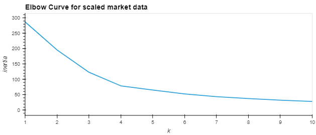
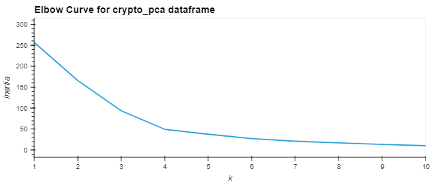
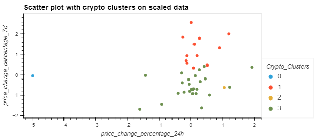
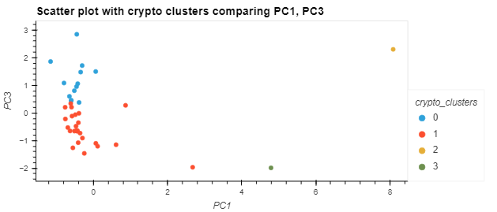
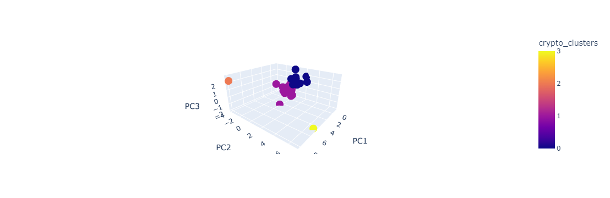

# Crypto-Portfolio-Predictor
Challenge 10 for Fintech bootcamp with UC Berkeley using Machine learning and Kmodels to predict tokens to use in a portfolio by means of clustering. After clustering using Kmeans, I condensed the data into fewer columns using principal component analysis (PCA). Then running the Kmeans clustering again to visualize the clusters. This helps us group different tokens into clusters using unsupervised learning machine algorithms. 

Follow below if you need to get setup with a `dev` environment to clone the repo locally and get the necessary requirements to run the notebook. Or skip further below if you have a `dev` env already setup and just want to see the results or get going.

---
## Packages and Version

First before installing any packages and getting setup make sure you are in a `dev` environment or an environment(env) you are comfortable downloading packages into. 
To get your `dev` environment setup do the following in your command line:

- Creating a dev environment for python 3.7 called 'dev' - if you do not already have an environment setup 
    - Get setup in your preferred CLI (Gitbash, terminal, etc)
    - `conda create -n dev python=3.7 anaconda`
    - Once you have created the environment, type the following to activate and deactivate.

Once you are setup with your `dev` or similar env the only packages you need to have are listed below:

- hvplot == 0.8.1 or higher
- scikit-learn == 1.0.2 or higher
- up-to-date voila package (to visualize notebook in browser)

Simply do a `pip install package` replacing 'package' with the package name you are missing. 
Next make sure you clone the repo locally in the directory of your choice and follow below once ready.

---
## Usage and Results

Once you are setup with the `dev` env and have cloned the repo locally, navigate to the file within your preferred command line interface (CLI) and type `jupyter lab` to view the full notebook and be free to edit it yourself. Type `voila crypto_investments.ipynb` if you want to view it in a browser with all the background code removed.

Once I inputted the crypto data from the CSV provided, i scaled the data so that all the numbers would be in a more relatable range for the model. After i got the elbow plots for both the scaled data and the PCA data to find the best numbers for my 'k' for the Kmeans model to find the different clusters. The elbow plots can be seen below:

The two charts above look very similar, but if you look closely, you can see that the PCA data has a lower value for the inertia for each respective point compared to the scaled data. Showing that the clusters get closer, and the data is more accurate in relating clusters together. We can see the results with the same k for both the scaled and PCA data which is a k value of four.

With these scatter charts above we can clearly see a difference between the scaled dated scatter plots and the clusters the model defined, vs the PCA data and the clusters the model defined. The PCA data is more defined, and the clusters clearly seem to be different from each other. I went back and applied these PCA defined clusters to see what the two dots were that were far from the pack. The belonged to 'Ethlend' and 'Celsius-degree token' two tokens I’m not personally familiar with and seemed to have crazy returns in both the up and down direction which seems to be the reason for their separate groups. 
Despite those two clusters, the other two seem to have similar but different properties, so making an investment with a mix of tokens from both clusters would be an interesting strategy to see how the model performs over time.

---
## Contributors

[Robin Thorsen] (https://www.linkedin.com/in/robin-thorsen-079819120/) was the main developer/analyst working on this project. Starter code and resources provided by UC Berkeley.

Best reached via email - robinbthorsen@gmail.com

---

## License

Apache 2.0 public License applied, feel free to clone and fork and use and reach out if you have questions. 

